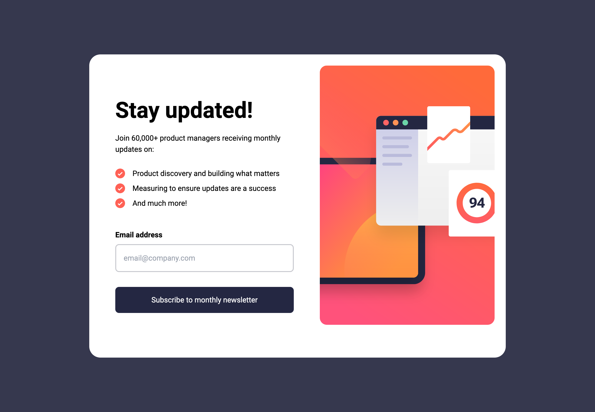

# Frontend Mentor - Newsletter sign-up form with success message solution

This is a solution to the [Newsletter sign-up form with success message challenge on Frontend Mentor](https://www.frontendmentor.io/challenges/newsletter-signup-form-with-success-message-3FC1AZbNrv). Frontend Mentor challenges help you improve your coding skills by building realistic projects.

## Table of contents

- [Overview](#overview)
  - [The challenge](#the-challenge)
  - [Screenshot](#screenshot)
  - [Links](#links)
- [My process](#my-process)
  - [Built with](#built-with)
  - [Useful resources](#useful-resources)
- [Author](#author)
- [Acknowledgments](#acknowledgments)

## Overview

### The challenge

Users should be able to:

- Add their email and submit the form
- See a success message with their email after successfully submitting the form
- See form validation messages if:
  - The field is left empty
  - The email address is not formatted correctly
- View the optimal layout for the interface depending on their device's screen size
- See hover and focus states for all interactive elements on the page

### Screenshot

### Links

- Solution URL: [Here](https://github.com/tomtrin/fe_newsletter_signup_component)
- Live Site URL: [Here](https://tomtrin.github.io/fe_newsletter_signup_component/)

## My process

### Built with

- Test Driven Development
- Semantic HTML5 markup
- TailwindCSS
- Typescript
- [React](https://reactjs.org/) - JS library
- [Vite](https://vitejs.dev/) - Blazing-fast tool for project scaffolding and bundling
- [@swc/jest](https://swc.rs/docs/usage/jest) - Jest (Rust based runner)

### Useful resources

- [https://hung.dev/posts/jest-vite](https://hung.dev/posts/jest-vite) - This blog post helped me set up @swc/jest in the project for unit testing
- [template-configs](https://github.com/tomtrin/template-configs) - Project I created to help install tailwind & unit testing dependencies / config files to my Vite + Typescript based React projects.

## Author

- Github - [tomtrin](https://github.com/tomtrin)
- Frontend Mentor - [@tomtrin](https://www.frontendmentor.io/profile/tomtrin)

